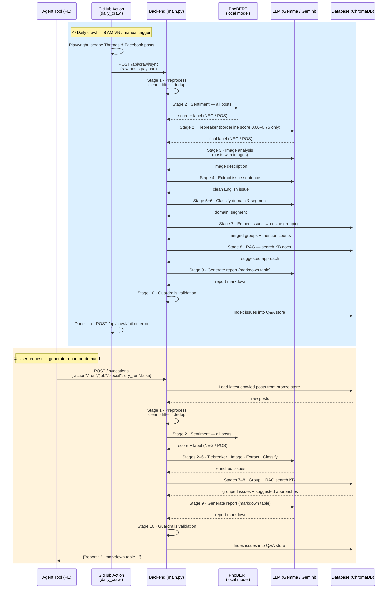

# Zalopay Issue Analytics Agent

An AI pipeline that fetches complaints from social media (Facebook, Threads), filters and classifies them, then generates structured issue reports for Product Owners — plus an agentic Q&A endpoint. Jira integration is planned for a future release.

Link demo: [ZALOPAY COMPLAINT ANALYTICS AI AGENT](https://endpoint-1d0e4738-5aaf-40ca-91be-edd302527db2.agentbase-runtime.aiplatform.vngcloud.vn)
Link youtube: [Youtube demo](https://youtu.be/nJt1l0i4hoY)

> **Deployed as a VNG AgentBase Custom Agent.** The LLM is `google/gemma-4-31b-it` via the OpenAI-compatible
> MaaS endpoint. `main.py` is the AgentBase entrypoint (`/invocations`); `local_api.py` is the local FastAPI
> dev harness. For local/Colab development you can also point `llm_client` at Google Gemini (free tier).
> Full design & status: `vault/Projects/00 - Project Home.md`.
> **Step-by-step real-data testing:** see [`HOW_TO_TEST.md`](HOW_TO_TEST.md).

---

## Table of Contents

- [1) What It Does](#1-what-it-does)
- [2) Architecture](#2-architecture)
- [3) Sequence Diagram](#3-sequence-diagram)
- [4) Key Technical Techniques](#4-key-technical-techniques)
- [5) File Map](#5-file-map)
- [6) Local Setup](#6-local-setup)
  - [1. Clone and enter the project](#1-clone-and-enter-the-project)
  - [2. Create and Activate a Virtual Environment](#2-create-and-activate-a-virtual-environment-venv)
  - [3. Install dependencies](#3-install-dependencies)
  - [4. Configure your LLM provider](#4-configure-your-llm-provider)
  - [5. Verify setup](#5-verify-setup)
  - [6. Run Local FastAPI Server & Frontend UI](#6-run-local-fastapi-server--frontend-ui)
- [7) Running Tests](#7-running-tests)
  - [Test individual pipeline stages](#test-individual-pipeline-stages)
  - [Run the full Phase 2 test suite](#run-the-full-phase-2-test-suite)
  - [Build the knowledge base index](#build-the-knowledge-base-index-phase-3--no-api-key-needed)
  - [Test the knowledge base search](#test-the-knowledge-base-search)
- [8) How the Pipeline Flows (Code Trace)](#8-how-the-pipeline-flows-code-trace)
- [9) LLM Provider Reference](#9-llm-provider-reference)
- [10) Deploy to AgentBase](#10-deploy-to-agentbase)
- [11) Crawling (Bronze layer)](#11-crawling-bronze-layer)
- [12) Build Status](#12-build-status)
- [13) Environment Variables Reference](#13-environment-variables-reference)
- [14) Key Design Decisions](#14-key-design-decisions)

---

## 1) What It Does

One job is live in this MVP; a second is planned:

- **Job 1 — Jira** *(planned — not available in MVP)*: Will pull internal support tickets, extract issues, classify by domain/segment, search the knowledge base for solutions, and generate a report.
- **Job 2 — Social Media** *(active)*: Searches Facebook and Threads by keyword, keeps only negative posts (sentiment filter), analyzes any images, extracts and groups issues, generates a report.

Output: a markdown table like this:

| # | Issue | Description | Domain | Segment | Sources | Mentions | Suggested Approach |
|---|-------|-------------|--------|---------|---------|----------|--------------------|
| 1 | Visa top-up failing | Error E5001 after confirming card | Payment | Top-up | FB-2001, TH-3002 | 2 | Check payment gateway... |

---

## 2) Architecture

```
DATA SOURCES
  Jira API (planned) ────────────────────────────────────────────┐
  Facebook keyword search ──┐                                    │
  Threads keyword search ───┘                                    │
                             │                                   │
                             ▼                                   ▼
                    ┌─────────────────┐               ┌─────────────────────────┐
                    │   SOCIAL JOB    │               │  JIRA JOB (planned)     │
                    └────────┬────────┘               └────────────┬────────────┘
                             │                                 │
              ╔══════════════╪═════════════════════════════════╪══════╗
              ║  SHARED PIPELINE STAGES                        │      ║
              ║                                                │      ║
              ║  Stage 1: Preprocess ◄─────────────────────────┘      ║
              ║    clean_text() — remove URLs, emoji, @mentions        ║
              ║    is_meaningful() — drop posts < 4 words              ║
              ║    deduplicate() — fingerprint dedup                   ║
              ║          │                                             ║
              ║  Stage 2: Sentiment filter (Social only)               ║
              ║    PhoBERT ML model → fast pass                        ║
              ║    Claude/Gemini LLM → borderline tiebreaker           ║
              ║    Keep only negative posts                            ║
              ║          │                                             ║
              ║  Stage 3: Image analysis (if images present)           ║
              ║    Claude Vision / Gemini Vision → describe image      ║
              ║    Compare with sample_images/ reference set           ║
              ║          │                                             ║
              ║  Stage 4: Issue extraction                             ║
              ║    LLM → one clean English sentence per post           ║
              ║    e.g. "Visa card top-up failing with error E5001"    ║
              ║          │                                             ║
              ║  Stage 5: Domain classification                        ║
              ║    LLM → Payment | QR Code | Account | ...             ║
              ║                                                        ║
              ║  Stage 6: Segment classification                       ║
              ║    LLM → Top-up | Transfer | Login | OTP | ...        ║
              ║          │                                             ║
              ║  Stage 7: Semantic grouping                            ║
              ║    Embeddings → cosine similarity                      ║
              ║    Merge near-duplicate issues, count mentions         ║
              ║          │                                             ║
              ║  Stage 8: RAG — knowledge base search                  ║
              ║    Embed issue → search ChromaDB                       ║
              ║    Retrieve top-k KB docs → suggested approach         ║
              ║          │                                             ║
              ║  Stage 9: Report generation                            ║
              ║    LLM → markdown table                                ║
              ║          │                                             ║
              ║  Stage 10: Guardrails                                  ║
              ║    Validate format, completeness, no hallucinations    ║
              ╚══════════════╪═════════════════════════════════════════╝
                             │
                    ┌────────▼────────┐
                    │  output/ report │
                    └─────────────────┘

TRIGGER LAYER
  AgentBase entrypoint (main.py) → POST /invocations
     {"action":"run","job":"social"}            → run a pipeline + index issues  (jira: planned)
     {"action":"query","question":"..."}        → agentic Q&A (RAG over indexed issues)
  Local dev: local_api.py (FastAPI + APScheduler) — not shipped
```

---

## 3) Sequence Diagram

Two runtime flows — **daily crawl** (automated) and **user query** (on-demand):



---

## 4) Key Technical Techniques

### 4.1 PhoBERT — Vietnamese Sentiment Analysis

**What it is:** [PhoBERT](https://github.com/VinAIResearch/PhoBERT) is a BERT-based transformer pre-trained on 20GB of Vietnamese text by VinAI Research. It understands Vietnamese morphology far better than a general multilingual model.

**How it's used here (Stage 2):**

```
Post text → PhoBERT tokenizer → transformer → confidence score (0–1)
  score ≥ 0.75  → hard NEG / POS  (no LLM call — ~80% of posts)
  score 0.60–0.75 → borderline → LLM tiebreaker
  score < 0.60  → hard POS (discard)
```

**Why this design:** PhoBERT runs locally in milliseconds at zero API cost. Calling the LLM for every post would be 5–10× slower and expensive at scale. The two-stage approach keeps latency low while using the LLM's reasoning only where the signal is ambiguous.

**Model size:** ~500 MB (CPU build, downloaded on first run from Hugging Face; baked into the Docker image for production).

---

### 4.2 RAG — Retrieval-Augmented Generation

Two separate ChromaDB collections power the RAG layer:

| Collection | Contents | Used in |
|------------|----------|---------|
| `knowledge_base` | 5 solution docs (account, payment, QR code, app performance, merchant) — chunked into ~17 passages | Stage 8: retrieve suggested fix for each issue |
| `taxonomy` | `docs/taxonomy.md` — domain/segment definitions and examples | Stages 5+6: ground LLM classification in exact vocabulary |

**Flow (Stage 8 — solution retrieval):**
```
issue sentence → MiniLM embedding → cosine search in knowledge_base
→ top-k passages → injected into LLM prompt as context
→ LLM generates "Suggested Approach" grounded in KB docs
```

**Flow (Stages 5+6 — RAG-grounded classification):**
```
issue sentence → embedding → cosine search in taxonomy collection
→ retrieve canonical domain/segment examples
→ LLM classifies using retrieved vocabulary (no hallucinated categories)
```

**Why ChromaDB:** embedded, zero-config, runs in-process. The index is built at image build time and baked into the Docker image, so there is no cold-start delay in production.

---

### 4.3 Semantic Grouping via Sentence Embeddings

**What it is (Stage 7):** after extracting individual issue sentences, many posts describe the same problem (e.g. five users all report "Visa top-up failing"). Reporting each separately inflates the issue count and hides signal.

**How it works:**
```
issue sentences → MiniLM (all-MiniLM-L6-v2) → 384-dim embeddings
→ pairwise cosine similarity matrix
→ greedy clustering: merge if similarity > 0.82 threshold
→ output: deduplicated groups with merged source lists + mention count
```

**Why MiniLM:** 22 MB, CPU-fast, strong English semantic similarity. Issues are extracted in English (Stage 4), so Vietnamese morphology is not a concern at this stage.

---

### 4.4 Two-Tier LLM Strategy

All LLM calls are routed through `llm_client.py` using one of two model slots:

| Slot | Env var | Default (Google) | Used for |
|------|---------|-----------------|---------|
| `FAST` | `MODEL_FAST` | `gemini-2.5-flash-lite` | Stages 2, 4, 5, 6 — high-volume, short output |
| `SMART` | `MODEL_SMART` | `gemini-2.5-pro` | Stage 9 — full report generation, long context |

This keeps per-run cost low: classification calls (which dominate by count) use the cheapest model; only the single report-generation call uses the more capable model.

---

### 4.5 Vision Analysis for Screenshots

**What it is (Stage 3):** social media posts about payment errors often include screenshots (error dialogs, transaction receipts). The image is base64-encoded by the crawler and sent to the LLM's vision endpoint.

**How it works:**
```
post.images (base64 list)
→ compare MD5 against sample_images/ reference set per domain
→ if no exact match: send to LLM vision (Gemma / Gemini)
  prompt: "Describe the UI error or state shown in this screenshot"
→ image_description appended to post text before Stage 4 extraction
```

**Reference images** (`sample_images/Payment/`, `QR_Code/`, etc.) allow the system to skip the LLM call for known, recurring error screens — reducing latency and cost for common cases.

---

## 5) File Map

```
clawathon-aicbc-agent/
│
├── main.py                ← AgentBase entrypoint (/invocations: run | query)
├── local_api.py           ← local FastAPI + APScheduler dev harness (not shipped)
├── config.py              ← all settings: provider, models (LLM_BASE_URL), domains, thresholds
├── llm_client.py          ← pluggable LLM wrapper (MaaS/OpenAI · Google · Anthropic)
├── mock_data.py           ← fake Jira tickets + social posts for development
│
├── processors/            ← one file per pipeline stage
│   ├── preprocessor.py    ← Stage 1: clean, filter, deduplicate (no API)
│   ├── sentiment.py       ← Stage 2: PhoBERT + LLM tiebreaker
│   ├── issue_extractor.py ← Stage 4: LLM → clean English issue sentence
│   ├── classifier.py      ← Stages 5+6: RAG-grounded domain → segment
│   ├── grouper.py         ← Stage 7: embeddings → merge near-duplicates
│   └── image_analyzer.py  ← Stage 3: Gemma vision on screenshots
│
├── crawlers/              ← offline Playwright scrapers (runs offline)
│   ├── threads_crawler.py ← crawls Threads posts matching search keywords
│   ├── threads_comment_crawler.py ← crawls comments of scraped Threads posts
│   └── bronze.py          ← shared raw file IO utility
│
├── connectors/            ← data fetchers: Facebook, Threads (active); Jira (built, not active in MVP)
│   ├── jira.py            ← Jira REST API client (planned — not active in MVP)
│   ├── facebook.py        ← Facebook Graph API keyword search
│   └── threads.py         ← Threads API keyword search
│
├── knowledge_base/        ← RAG (built): solution docs + taxonomy + issues store
│   ├── index.py           ← build ChromaDB indexes (knowledge_base + taxonomy)
│   ├── search.py          ← solution search() + search_taxonomy()
│   ├── issues_store.py    ← index_issues() + answer_question() for agentic Q&A
│   └── docs/              ← solution docs + taxonomy.md (domain/segment grounding)
│
├── report/                ← report generation (built)
│   ├── generator.py       ← LLM → markdown table from grouped issues
│   └── guardrails.py      ← validate report format and completeness
│
├── jobs/                  ← full pipeline runners (built)
│   ├── jira_job.py        ← runs stages 1,4,5,6,7,8,9,10 on Jira data (planned — not active in MVP)
│   └── social_job.py      ← runs stages 1,2,3,4,5,6,7,8,9,10 on social data
│
├── sample_images/         ← reference screenshots per domain
│   ├── Payment/
│   ├── QR_Code/
│   ├── Account/
│   ├── App_Performance/
│   └── Merchant/
│
├── output/                ← generated reports land here
├── .env                   ← your secrets (never committed)
├── .env.example           ← template to copy from
└── requirements.txt
```

---

## 6) Local Setup

### 1. Clone and enter the project

```bash
cd ai-chay-bang-com-agent
```

### 2. Create and Activate a Virtual Environment (`venv`)

It is **strongly recommended** to use a virtual environment (`venv`) to isolate dependencies and prevent version conflicts with your system's global Python or global Conda `(base)` environment (which could break other packages like `streamlit` or `matplotlib`).

**Create the environment:**
```bash
python3 -m venv .venv
```

**Activate the environment:**
* **Mac/Linux:**
  ```bash
  source .venv/bin/activate
  ```
* **Windows (Command Prompt):**
  ```cmd
  .venv\Scripts\activate
  ```
* **Windows (PowerShell):**
  ```powershell
  .venv\Scripts\Activate.ps1
  ```

*(You should see `(.venv)` prepend your terminal command prompt once activated.)*

### 3. Install dependencies

Ensure you are inside the activated virtual environment, then run:
```bash
pip install -r requirements.txt
```

*(Optional) If you also want to run the crawler scripts:*
```bash
pip install -r requirements-crawler.txt
python -m playwright install chromium
```

> `torch` is large (~200MB CPU build). First install takes 2–5 minutes.
>
> If `torch` fails, install it explicitly:
> ```bash
> pip install torch --index-url https://download.pytorch.org/whl/cpu
> ```

### 4. Configure your LLM provider

Copy the example env file:

```bash
cp .env.example .env
```

Edit `.env` — choose one provider and paste its key:

```env
# Option A — Google AI Studio (free tier: ~20 req/day)
LLM_PROVIDER=google
LLM_API_KEY=AIzaSy...

# Option B — Anthropic Claude ($5 free credits at console.anthropic.com)
LLM_PROVIDER=anthropic
LLM_API_KEY=sk-ant-api03-...

# Option C — OpenAI
LLM_PROVIDER=openai
LLM_API_KEY=sk-proj-...
```

Model names are set automatically from the provider. Override in `.env` if needed:

```env
MODEL_FAST=gemini-2.5-flash-lite   # cheap model — used for classification
MODEL_SMART=gemini-2.5-pro          # smart model — used for report writing
```

### 5. Verify setup

```bash
.venv/bin/python -c "
from llm_client import llm
print(llm.chat(system='Reply with one word.', user='Say hello', max_tokens=5))
"
```

Expected: `Hello` (or equivalent)

### 6. Run Local FastAPI Server & Frontend UI

To run the local FastAPI server (serving both the database-backed REST APIs, ingestion callbacks, and the statically mounted Frontend Control Center UI) on port `8080`, execute:

```bash
.venv/bin/python3 main.py
```

*(Note: For offline local development/testing without database dependencies, you can still run the in-memory fallback harness: `.venv/bin/python3 local_api.py`)*

> [!TIP]
> Nếu bạn gặp lỗi `address already in use` (cổng 8080 đang bị chiếm), chạy lệnh sau để giải phóng cổng:
> ```bash
> [ -n "$(lsof -t -i:8080)" ] && kill -9 $(lsof -t -i:8080) || true
> ```

Once started, open your browser and navigate to:
👉 **http://localhost:8080**

---

## 7) Running Tests

### Test individual pipeline stages

#### Stage 1 — Preprocessor (no API key needed)

```bash
.venv/bin/python -c "
from processors.preprocessor import preprocess
from mock_data import get_mock_social
result = preprocess(get_mock_social())
print(f'{len(result)} posts after cleaning')
for p in result:
    print(' ', p['id'], ':', p['text'][:60])
"
```

#### Stage 2 — Sentiment filter (downloads PhoBERT ~500MB on first run)

```bash
.venv/bin/python -c "
from processors.sentiment import filter_negative
from processors.preprocessor import preprocess
from mock_data import get_mock_social

posts = preprocess(get_mock_social())
negative = filter_negative(posts)
print(f'{len(posts)} total → {len(negative)} negative')
for p in negative:
    print(' KEEP:', p['id'], p['text'][:55])
dropped = [p for p in posts if p not in negative]
for p in dropped:
    print(' DROP:', p['id'], p['text'][:55])
"
```

Expected: 6 kept (negative), 2 dropped (positive).

#### Stage 4 — Issue extraction (requires API key)

```bash
.venv/bin/python -c "
from processors.issue_extractor import extract_issue
cases = [
    'Zalopay bị lỗi rồi! Không nạp tiền được bằng Visa suốt 2 tiếng!!',
    'App Zalopay crash liên tục khi mở lên',
    'QR code scan failure at merchant terminal',
]
for text in cases:
    print('IN :', text[:60])
    print('OUT:', extract_issue(text))
    print()
"
```

#### Stages 5+6 — Classification (requires API key)

```bash
.venv/bin/python -c "
from processors.classifier import classify_domain, classify_segment
issues = [
    'Visa card top-up failing with error E5001',
    'QR code scan failure at merchant terminal',
    'OTP not received after login attempt',
    'App crashes on launch — Android device',
]
for issue in issues:
    domain  = classify_domain(issue)
    segment = classify_segment(issue, domain)
    print(f'{domain:15} / {segment:12} ← {issue}')
"
```

### Run the full Phase 2 test suite

```bash
.venv/bin/python test_phase2.py
```

### Build the knowledge base index (Phase 3 — no API key needed)

```bash
.venv/bin/python knowledge_base/index.py
```

Expected output:
```
Indexed 17 chunks from 5 docs → ChromaDB at .../chroma_db
  • account.md  (4 chunks)
  • app_performance.md  (3 chunks)
  ...
```

### Test the knowledge base search

```bash
.venv/bin/python test_phase3.py
```

This builds the index then runs 4 search tests — no API key needed. Takes ~5 seconds.

To test a single search manually:

```bash
.venv/bin/python -c "
from knowledge_base.index import build_index
from knowledge_base.search import get_suggested_approach
build_index()
print(get_suggested_approach('Visa payment failed with error E5001.'))
"
```

This runs all four processors in sequence. On first run, PhoBERT (~500MB) downloads automatically.

> **Google free tier note**: The free tier allows ~10–20 requests/minute/day depending on the model.
> The test suite makes ~14 LLM calls total. If you hit a rate limit, the client automatically
> waits and retries. Full run may take 2–3 minutes on free tier.

---

## 8) How the Pipeline Flows (Code Trace)

Here is what happens when the Social job runs on one Facebook post:

```
INPUT:
  {"id": "FB-2001", "source": "facebook",
   "text": "Zalopay bị lỗi rồi! Không nạp tiền được bằng Visa suốt 2 tiếng!!",
   "images": [], "timestamp": "2026-06-10T08:30:00"}

Stage 1 — preprocessor.py
  clean_text()       → "Zalopay bị lỗi rồi Không nạp tiền được bằng Visa suốt 2 tiếng"
  is_meaningful()    → True (10 words ≥ 4)
  deduplicate()      → kept (first 80 chars not seen before)

Stage 2 — sentiment.py
  PhoBERT model      → {"label": "NEG", "score": 0.94}
  score ≥ 0.75       → True, skip LLM tiebreaker
  is_negative()      → True → POST KEPT

Stage 3 — image_analyzer.py (not built yet)
  images = []        → skipped, image_description = ""

Stage 4 — issue_extractor.py
  LLM call (fast)    → "Visa payment failing for two hours with error code."
  
Stage 5 — classifier.py → classify_domain()
  LLM call (fast)    → "Payment"

Stage 6 — classifier.py → classify_segment()
  LLM call (fast)    → "Top-up"

Stage 7 — grouper.py (not built yet)
  Embedding of issue → [0.12, -0.34, ...]
  Cosine similarity  → matches TH-3002 (same issue, score 0.91 > threshold 0.82)
  Merged into group  → mentions = 2, sources = [FB-2001, TH-3002]

Stage 8 — knowledge_base/search.py (not built yet)
  Embed issue        → search ChromaDB
  Top match          → "payment-gateway-errors.md" (similarity 0.87)
  Suggested approach → "Check payment gateway timeout config..."

Stage 9 — report/generator.py (not built yet)
  LLM call (smart)   → builds markdown table row

Stage 10 — report/guardrails.py (not built yet)
  Validate row       → all columns present, no hallucination markers

OUTPUT ROW:
  | 1 | Visa top-up failing | Error code reported, 2+ hours... | Payment | Top-up |
    FB-2001, TH-3002 | 2 | Check payment gateway timeout... |
```

---

## 9) LLM Provider Reference

The `llm_client` is pluggable. **Production = AgentBase MaaS** (OpenAI-compatible, single Gemma model).
**Local/Colab dev = Google Gemini** (free tier) so you can test stage-by-stage without MaaS access.

| Provider | Config | Used for |
|----------|--------|----------|
| `openai` + `LLM_BASE_URL` | `LLM_PROVIDER=openai`, `LLM_BASE_URL=https://maas-llm-aiplatform-hcm.api.vngcloud.vn/v1`, `MODEL_*=google/gemma-4-31b-it` | **AgentBase deployment (MaaS)** |
| `google` | `LLM_PROVIDER=google`, `LLM_API_KEY=AIzaSy...` | Local/Colab dev (free; `gemini-2.5-flash` for SMART — `pro` is blocked on free tier) |
| `anthropic` / `openai` (real) | standard keys | optional alternates |

Switching is two `.env` lines — no code changes. See `.env.example` (dev) and `.env.agentbase.example` (deploy).

## 10) Deploy to AgentBase

### One-time setup (first deploy only)

1. **Credentials:** copy `.greennode.json.example` → `.greennode.json` and fill `client_id`/`client_secret`
   (from `iam.console.vngcloud.vn/service-accounts`). Create a MaaS LLM key via `/agentbase-llm`.
2. **Env:** copy `.env.agentbase.example` → an env file; set `LLM_API_KEY` (MaaS) + connector creds.
   Do **not** set `GREENNODE_*` (auto-injected at runtime).
3. **GitHub Secrets:** the CI/CD pipeline reads three repository secrets — set them once in
   **Settings → Secrets and variables → Actions**:
   | Secret | Value |
   |--------|-------|
   | `GREENNODE_CLIENT_ID` | your service-account `client_id` |
   | `GREENNODE_CLIENT_SECRET` | your service-account `client_secret` |
   | `GREENNODE_ENV_FILE` | the full contents of your `.env` file (paste as-is) |
   | `HF_TOKEN` | Hugging Face token (needed to bake PhoBERT into the image) |

### Triggering a deploy

The [**Build and Deploy** GitHub Actions workflow](https://github.com/aq2208/ai-chay-bang-com-agent/actions/workflows/deploy.yml)
builds a `linux/amd64` Docker image (with PhoBERT + MiniLM + ChromaDB index baked in),
pushes it to VCR, and hot-updates the running AgentBase runtime — no first-request model download.

**Option A — Manual trigger (no tag needed)**

Go to the workflow page and click **Run workflow**:

> [https://github.com/aq2208/ai-chay-bang-com-agent/actions/workflows/deploy.yml](https://github.com/aq2208/ai-chay-bang-com-agent/actions/workflows/deploy.yml)

The image is tagged `v<run_number>` automatically.

**Option B — Tag a release**

Push a `v*` tag and the workflow fires automatically:

```bash
git tag v1.2.0
git push origin v1.2.0
```

The image is tagged with the same tag (`v1.2.0`). Use this for versioned production releases.

### Invoke the deployed agent

```jsonc
// POST <endpoint>/invocations
{"action": "run", "job": "all", "dry_run": false}              // run pipelines + index issues
{"action": "query", "question": "summarize payment issues this week"}  // agentic Q&A
```

Health check: `GET <endpoint>/health`.

## 11) Crawling (Bronze layer)

Crawling is **decoupled** from the agent and runs **offline** (Colab / a worker / locally) — headless
Chromium is too heavy and easily blocked from datacenter IPs, and a scroll-crawl would exceed the
invocation timeout. Crawlers write raw records to `data/raw/<source>_<ts>.jsonl`; connectors read the
latest bronze file and normalize it.

```bash
pip install -r requirements-crawler.txt
python -m playwright install chromium

# 1. Crawl threads posts matching keywords:
python -m crawlers.threads_crawler          # → data/raw/threads_<ts>.jsonl

# 2. Crawl comments/replies of those threads posts:
python -m crawlers.threads_comment_crawler  # → data/raw/threads_comments_<ts>.jsonl
```

- `crawlers/threads_crawler.py` — Playwright public keyword search on `threads.net/search`; filters by post age, downloads images as base64, and dedups by MD5. Uses `config.KEYWORDS` / `DAYS_BACK`.
- `crawlers/threads_comment_crawler.py` — Playwright deep post crawler that navigates to each thread's post URL to scroll and load comments/replies.
- `crawlers/bronze.py` — shared JSONL IO (`save` / `load_latest`).
- `connectors/threads.py` — reads the latest bronze file, maps `SocialPost` → `{id, source, text, images, timestamp}`.
- Then run the pipeline against it: `{"action":"run","job":"social","dry_run":false}`.

---

## 12) Build Status

| Area | Status |
|------|--------|
| Skeleton, config, mock data | ✅ Done |
| Processors: preprocessor, sentiment, issue extractor, classifier | ✅ Done |
| Knowledge base — 5 solution docs + taxonomy, ChromaDB (`knowledge_base` + `taxonomy`) | ✅ Done |
| Image analyzer, semantic grouper | ✅ Done |
| Report generator + guardrails | ✅ Done |
| Job runner `social_job.py` | ✅ Done |
| Job runner `jira_job.py` | 🔜 Built, not active in MVP |
| **RAG-grounded classification** (taxonomy retrieval) | ✅ Done |
| **Agentic Q&A** (`knowledge_base/issues_store.py` + `query` action) | ✅ Done |
| Connectors: Facebook, Threads | ✅ Done |
| Connector: **Jira** | 🔜 Built, not active in MVP |
| LLM client → MaaS (`LLM_BASE_URL`, single Gemma) | ✅ Done |
| **AgentBase entrypoint** (`main.py`) + `local_api.py` dev harness | ✅ Done |
| Dependencies + Dockerfile (baked models/index) + AgentBase config templates | ✅ Done |
| Local e2e on mock data (via Google) | ✅ Verified |
| MaaS Gemma live test (text + vision) | ⛔ Needs a real MaaS key |
| Deploy to AgentBase | ⛔ Needs MaaS key + `.greennode.json` |

---

## 13) Environment Variables Reference

| Variable | Required | Description |
|----------|----------|-------------|
| `LLM_PROVIDER` | Yes | `anthropic` \| `google` \| `openai` |
| `LLM_API_KEY` | Yes | API key for the chosen provider |
| `MODEL_FAST` | No | Override fast model name (default auto per provider) |
| `MODEL_SMART` | No | Override smart model name (default auto per provider) |
| `JIRA_URL` | Future (Jira not in MVP) | Your Jira instance URL |
| `JIRA_EMAIL` | Future (Jira not in MVP) | Jira account email |
| `JIRA_API_TOKEN` | Future (Jira not in MVP) | Jira API token |
| `FB_PAGE_ID` | Phase 8 | Facebook page ID to search |
| `FB_ACCESS_TOKEN` | Phase 8 | Facebook Graph API token |
| `THREADS_ACCESS_TOKEN` | Phase 8 | Threads API token |

---

## 14) Key Design Decisions

**Pipeline, not a conversational agent.** Each stage is a small, focused LLM call. This is cheaper, faster, and easier to debug than one giant prompt.

**PhoBERT before LLM for sentiment.** The ML model handles ~80% of cases in milliseconds for free. LLM is only called for the borderline 20%.

**Two independent jobs (by design).** The Social job runs independently in this MVP. When the Jira job is added, both can fail, be triggered, and be scheduled independently — a Facebook API outage won't block the Jira report.

**Pluggable LLM.** All LLM calls go through `llm_client.py`. Swap providers in `.env` — zero code changes.

**Mock data for development.** `mock_data.py` provides realistic test data so you can develop and test every stage without real API credentials.
